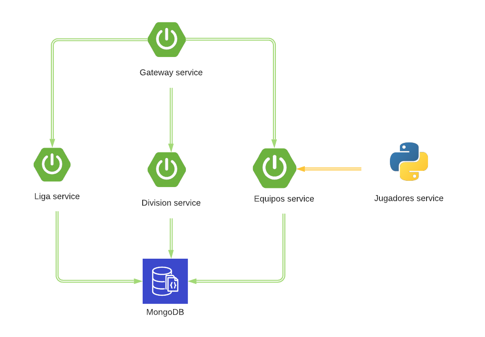
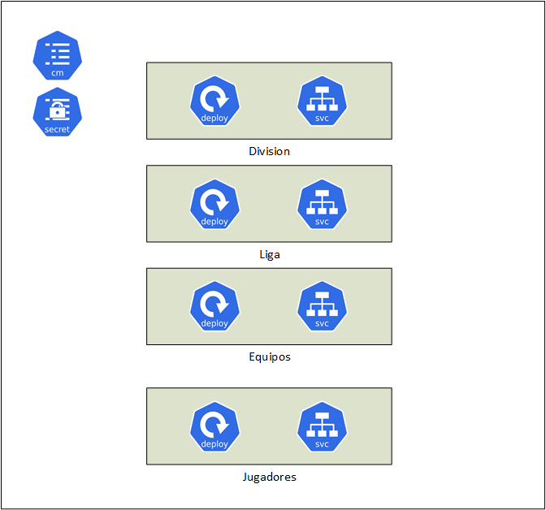

# Microservices con Spring Boot (Spring Cloud Kubernetes) y Python en un proyecto de demo


En este pequeño proyecto intento demostrar algunas de las características interesantes que Spring Cloud Kubernetes ofrece. Además, puesto que en un mundo de microservicios es muy probable que se trabaje con diferentes lenguajes de programación, he optado por crear un servicio en Python, usando Flask. Éste tiene inter-comunicación con otros servicios desplegados. 

_En Español_??
sí, he optado por nombres y un readme en español porque...me apetecía escribir en Español :monkey_mouth_face :muscle 


A lo largo de este proyecto he logrado probar otras herramientas como son [Skaffold](https://skaffold.dev/), [JIB](https://skaffold.dev/docs/pipeline-stages/builders/jib/) e incluso una herramienta de monitorado del cluster de Kubernetes como es [Octant](https://octant.dev/)


## Prerequisitos ##
- Tener instalado un entorno de K8s: hay cientos de guías de cómo hacerlo, en mi opinión, lo más sencillo es con minikube o usando Docker Desktop

Para levantar los servicios en local en un IDE:

- Tener instalado JDK 11
- Tener instalado python 3.7
- Tener instalado maven

## Arquitectura ##

Este proyecto consta de 4 aplicaciones desarrollados en Spring boot y otra en Python. Asimismo, para las aplicaciones spring boot se ha usado una base de datos mongoDB para persistir los datos. La aplicación de Python, y por simplicidad, no se usa la base de datos mongoDB y sólo se guardan los objetos en memoria.

- **Gateway**: Zuul application que sirve como puerta de enlace a los otros micorservicios. Una característica útil ha consistido en que desde este microservicio se saquen el resto de endpoints del swagger. 
- **Liga service**: Spring boot application que sirve para guardar ligas de futol. Además, estas ligas pueden tener equipos y divisiones devolviendo un objeto compuesto.
- **Division service**: Spring boot application que sirve para guardar divisiones de futol. Multiples equipos pueden pertenecer a una division 
- **Equipos service**: Spring boot application que sirve para guardar equipos con un nombre y estadio. 
- **Jugadores service**: aplicación de Python (en Flask) para guardar Jugadores. Se pueden mostrar jugadores que pertenezcan a un equipo.



A nivel de Kubernetes los recursos que se usan se muestran en el siguente diagrama

Hay un configmap y un secret que se usan para los datos de conexión con la base de datos mongoDB. Por otra parte, cada aplicación se despliega usando un deployment y un service de kubernetes. 


Respecto a la base de datos mongoDB tiene su propio service y deployment en K8s.

Por último, tuve que crear un _Role_ y _RoleBinding_ para poder desplegar las aplicaciones en el cluster de Kuberentes.


## Despliegue ##

Lo primero que tenemos que hacer es deplegar los privilegios y la base de datos mongoDB con los siguientes comandos:

```
kubectl apply -f k8s/privileges.yaml
kubectl apply -f k8s/clusterroles.yaml


kubectl apply -f k8s/mongodb-configmap.yaml
kubectl apply -f k8s/mongodb-secret.yaml
kubectl apply -f k8s/mongodb-deployment.yaml


```

A continuación, tenemos que desplegar los configmaps de cada una de las aplicaciones Java. Para incluir un application.yml en un ConfigMap, se deberá crear el ConfigMap haciendo uso de la sintaxis de Kubernetes y en su interior en la parte de datos, se incorporará el application.yml o application.properties. En el caso en el que el nombre del ConfigMap y el Namespace no se informen se tomará el Namespace por defecto en el que se encuentre desplegada la aplicación y el ConfigMap será el del nombre de la aplicación. En cualquier caso, existen otras propiedades para configurar el configmap:

| Propiedad | Descripción |
| ------------- | ------------- |
| spring.cloud.kubernetes.config.enabled | Activa o desactiva la configuración con configMap, por defecto es TRUE. |
| spring.cloud.kubernetes.config.name |	El nombre del ConfigMap, por defecto es spring.application.name|
|spring.cloud.kubernetes.config.namespace	|	Establece el nombre del namespace, por defecto en donde se encuentra desplegado|

```
kubectl apply -f k8s/division-configmap.yaml
kubectl apply -f k8s/equipos-configmap.yaml
kubectl apply -f k8s/liga-configmap.yaml
kubectl apply -f k8s/gateway-configmap.yaml

```

En la carpeta k8s, se encuentran los ficheros declarativos para poder desplegar cada uno de los componentes anteriormente descritos. Además, se puede encontrar el fichero Dockerfile para poder construir la imagen. No obstante, y para el caso de Java vamos a utilizar [Skaffold](https://skaffold.dev/) con [JIB](https://skaffold.dev/docs/pipeline-stages/builders/jib/). 

A grosso modo, Skaffold es una herramienta de línea de comandos que facilita el desarrollo continuo en aplicaciones nativas de Kubernetes. Skaffold gestiona los flujos de build,push y deploy usando un descriptor llamado **skaffold.yaml** donde se describe el service las acciones de build y metadata. 

Para construir las imagenes podemos escribir nuestro propio Dockerfile o usar JIB( desarrollada por Google) para contenerizar(what!) aplicaciones Java. JIB es rápido ya que separa la aplicación en múltiples capas, reproducible, además de daemonless, contruyendo la imagen con Maven o Gradle. 

En este proyecto se ha incluido la siguiente configuración en el pom.xml

```
            <plugin>
				<groupId>com.google.cloud.tools</groupId>
				<artifactId>jib-maven-plugin</artifactId>
				<version>3.1.4</version>
				<configuration>
					<from>
						<image>adoptopenjdk/openjdk11:jre-11.0.11_9-alpine</image>
					</from>
				</configuration>
			</plugin>
```

Para poder generar las imagenes con JIB. 

Una vez instalado Skaffold, con el comando 

```
skaffold dev --trigger notify

```
permite realizar cambios de código fuente al realizar un cambio en nuestro workspace, mientras que con el comando

```
skaffold debug

```
proporciona la misma funcionalidad que el modo dev, pero permite hacer attach con el IDE correspondiente y ejecutar debugging.

También se puede ejecutar el comando

```
skaffold run

```

Por último, para el micro escrito en Python, Jugadores service, se tiene que desplegar de manera manual:


```
kubectl apply -f k8s/jugadores.yaml

```


## Monitorado ##

Para el monitorado he optado por probar la solución de [Octant](https://octant.dev/)
